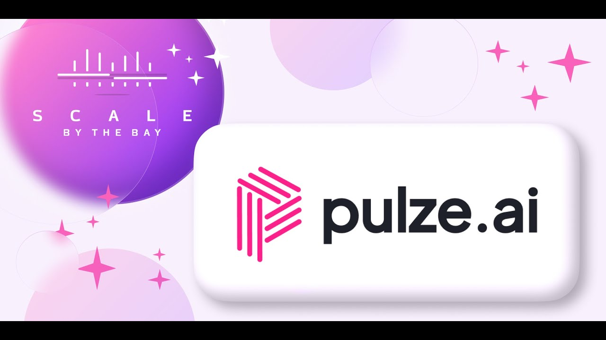

<div align="left">

[](https://www.pulze.ai&#x2F;)

# [Pulze.ai](https://www.pulze.ai&#x2F;)

At Pulze it's our mission to supercharge today's workforce with AI to maximize the world's prosperity. We are doing so by enabling companies of any size to securely leverage Large Language Models (LLM) and easily build AI features into their apps. Our enterprise platform has access to all best in class LLMs and can route user requests to the most relevant model to get the highest quality response at the best price thanks to our smart meta model. End users can leverage pre-built applications, such as our Marketing AI product, or build custom apps on top of the Pulze Platform.

We are a VC Funded, early stage startup based in San Francisco.

</div>

## Requirements

Building the API client library requires:

1. Java 1.8+
2. Maven (3.8.3+)/Gradle (7.2+)

If you are adding this library to an Android Application or Library:

3. Android 8.0+ (API Level 26+)

## Installation<a id="installation"></a>
<div align="center">
  <a href="https://konfigthis.com/sdk-sign-up?company=Pulze.ai&language=Java">
    
  </a>
</div>

### Maven users

Add this dependency to your project's POM:

```xml
<dependency>
  <groupId>com.konfigthis</groupId>
  <artifactId>pulze-ai-java-sdk</artifactId>
  <version>0.1.0</version>
  <scope>compile</scope>
</dependency>
```

### Gradle users

Add this dependency to your `build.gradle`:

```groovy
// build.gradle
repositories {
  mavenCentral()
}

dependencies {
   implementation "com.konfigthis:pulze-ai-java-sdk:0.1.0"
}
```

### Android users

Make sure your `build.gradle` file as a `minSdk` version of at least 26:
```groovy
// build.gradle
android {
    defaultConfig {
        minSdk 26
    }
}
```

Also make sure your library or application has internet permissions in your `AndroidManifest.xml`:

```xml
<!--AndroidManifest.xml-->
<?xml version="1.0" encoding="utf-8"?>
<manifest xmlns:android="http://schemas.android.com/apk/res/android"
    xmlns:tools="http://schemas.android.com/tools">
    <uses-permission android:name="android.permission.INTERNET"/>
</manifest>
```

### Others

At first generate the JAR by executing:

```shell
mvn clean package
```

Then manually install the following JARs:

* `target/pulze-ai-java-sdk-0.1.0.jar`
* `target/lib/*.jar`

## Getting Started

Please follow the [installation](#installation) instruction and execute the following Java code:

```java
import com.konfigthis.client.ApiClient;
import com.konfigthis.client.ApiException;
import com.konfigthis.client.ApiResponse;
import com.konfigthis.client.PulzeAi;
import com.konfigthis.client.Configuration;
import com.konfigthis.client.auth.*;
import com.konfigthis.client.model.*;
import com.konfigthis.client.api.AppsApi;
import java.util.List;
import java.util.Map;
import java.util.UUID;

public class Example {
  public static void main(String[] args) {
    Configuration configuration = new Configuration();
    configuration.host = "https://api.pulze.ai";
    
    // Configure HTTP bearer authorization: HTTPBearer
    configuration.token = "BEARER TOKEN";
    PulzeAi client = new PulzeAi(configuration);
    try {
      AppWithModelUpdatesInfo result = client
              .apps
              .getAppForApiKey()
              .execute();
      System.out.println(result);
      System.out.println(result.getApp());
      System.out.println(result.getFiles());
      System.out.println(result.getModelSettings());
    } catch (ApiException e) {
      System.err.println("Exception when calling AppsApi#getAppForApiKey");
      System.err.println("Status code: " + e.getStatusCode());
      System.err.println("Reason: " + e.getResponseBody());
      System.err.println("Response headers: " + e.getResponseHeaders());
      e.printStackTrace();
    }

    // Use .executeWithHttpInfo() to retrieve HTTP Status Code, Headers and Request
    try {
      ApiResponse<AppWithModelUpdatesInfo> response = client
              .apps
              .getAppForApiKey()
              .executeWithHttpInfo();
      System.out.println(response.getResponseBody());
      System.out.println(response.getResponseHeaders());
      System.out.println(response.getStatusCode());
      System.out.println(response.getRoundTripTime());
      System.out.println(response.getRequest());
    } catch (ApiException e) {
      System.err.println("Exception when calling AppsApi#getAppForApiKey");
      System.err.println("Status code: " + e.getStatusCode());
      System.err.println("Reason: " + e.getResponseBody());
      System.err.println("Response headers: " + e.getResponseHeaders());
      e.printStackTrace();
    }
  }
}

```

## Documentation for API Endpoints

All URIs are relative to *https://api.pulze.ai*

Class | Method | HTTP request | Description
------------ | ------------- | ------------- | -------------
*AppsApi* | [**getAppForApiKey**](docs/AppsApi.md#getAppForApiKey) | **GET** /v1/apps/self | Get App For Api Key
*AppsApi* | [**updateProperties**](docs/AppsApi.md#updateProperties) | **PUT** /v1/apps/update | Update App And Models
*ChatApi* | [**performCompletionRequest**](docs/ChatApi.md#performCompletionRequest) | **POST** /v1/chat/completions | Chat Completions
*CompletionsApi* | [**performTextRequest**](docs/CompletionsApi.md#performTextRequest) | **POST** /v1/completions | Completions
*LogsApi* | [**getById**](docs/LogsApi.md#getById) | **GET** /v1/logs/{log_id} | Get Log By Id
*LogsApi* | [**getMatchingLogs**](docs/LogsApi.md#getMatchingLogs) | **POST** /v1/logs | Get Logs For App
*LogsApi* | [**rateById**](docs/LogsApi.md#rateById) | **POST** /v1/logs/{log_id}/rating | Rate Log By Id
*ModelsApi* | [**getAllModels**](docs/ModelsApi.md#getAllModels) | **GET** /v1/models/all | Get All Available Models For App
*ModelsApi* | [**getRankOfBest**](docs/ModelsApi.md#getRankOfBest) | **POST** /v1/models/rank | Get Rank Of Best Models For Payload
*ModelsApi* | [**listActiveModels**](docs/ModelsApi.md#listActiveModels) | **GET** /v1/models/active | Get Active Models For App
*ModelsApi* | [**toggleModelForApp**](docs/ModelsApi.md#toggleModelForApp) | **PUT** /v1/models/{model_id}/toggle | Toggle Model For App


## Documentation for Models

 - [AcceptInviteRequest](docs/AcceptInviteRequest.md)
 - [App](docs/App.md)
 - [AppCreateData](docs/AppCreateData.md)
 - [AppCreateResponse](docs/AppCreateResponse.md)
 - [AppCustomData](docs/AppCustomData.md)
 - [AppDeleteResponse](docs/AppDeleteResponse.md)
 - [AppUpdate](docs/AppUpdate.md)
 - [AppWithModelUpdatesInfo](docs/AppWithModelUpdatesInfo.md)
 - [Auth0PostRegistrationRequest](docs/Auth0PostRegistrationRequest.md)
 - [Auth0PostRegistrationResponse](docs/Auth0PostRegistrationResponse.md)
 - [BillingAddPayment](docs/BillingAddPayment.md)
 - [BillingAddPaymentResult](docs/BillingAddPaymentResult.md)
 - [BillingPaymentCoupon](docs/BillingPaymentCoupon.md)
 - [BillingPaymentCreation](docs/BillingPaymentCreation.md)
 - [BillingPaymentInfo](docs/BillingPaymentInfo.md)
 - [BillingSubscription](docs/BillingSubscription.md)
 - [BillingTopUp](docs/BillingTopUp.md)
 - [BillingTransactionItem](docs/BillingTransactionItem.md)
 - [BillingTransactions](docs/BillingTransactions.md)
 - [BodyAppUploadCustomDataV1AppsCustomDataAppIdPost](docs/BodyAppUploadCustomDataV1AppsCustomDataAppIdPost.md)
 - [CompletionRequestPayload](docs/CompletionRequestPayload.md)
 - [ConversationShare](docs/ConversationShare.md)
 - [ConversationShareRequest](docs/ConversationShareRequest.md)
 - [ConversationSharedData](docs/ConversationSharedData.md)
 - [DashboardGraphData](docs/DashboardGraphData.md)
 - [FeaturesForSubscriptionDescriptions](docs/FeaturesForSubscriptionDescriptions.md)
 - [FilterLogsRequest](docs/FilterLogsRequest.md)
 - [FilteredSearch](docs/FilteredSearch.md)
 - [FrontendSettings](docs/FrontendSettings.md)
 - [FrontendSettingsResponse](docs/FrontendSettingsResponse.md)
 - [FunctionCallArguments](docs/FunctionCallArguments.md)
 - [FunctionParameters](docs/FunctionParameters.md)
 - [GetTableParams](docs/GetTableParams.md)
 - [GetTableSortParams](docs/GetTableSortParams.md)
 - [InternalCompanyData](docs/InternalCompanyData.md)
 - [InternalUserData](docs/InternalUserData.md)
 - [InvitationInfo](docs/InvitationInfo.md)
 - [InviteFormEmail](docs/InviteFormEmail.md)
 - [InviteFormRequest](docs/InviteFormRequest.md)
 - [LLMModelPolicies](docs/LLMModelPolicies.md)
 - [LLMModelWeights](docs/LLMModelWeights.md)
 - [LogResponseRatingRequest](docs/LogResponseRatingRequest.md)
 - [ModelData](docs/ModelData.md)
 - [ModelDataCreatePayloadForInternal](docs/ModelDataCreatePayloadForInternal.md)
 - [ModelDataUpdatePayloadForInternal](docs/ModelDataUpdatePayloadForInternal.md)
 - [ModelParts](docs/ModelParts.md)
 - [Org](docs/Org.md)
 - [OrgCreateRequest](docs/OrgCreateRequest.md)
 - [OrgCreateResponse](docs/OrgCreateResponse.md)
 - [OrgIntegrationItem](docs/OrgIntegrationItem.md)
 - [OrgIntegrationUpdate](docs/OrgIntegrationUpdate.md)
 - [OrgMember](docs/OrgMember.md)
 - [OrgMemberInvite](docs/OrgMemberInvite.md)
 - [OrgNameCheck](docs/OrgNameCheck.md)
 - [OrgUpdate](docs/OrgUpdate.md)
 - [OrgUsage](docs/OrgUsage.md)
 - [PaymentDetailsBalance](docs/PaymentDetailsBalance.md)
 - [PaymentDetailsLimits](docs/PaymentDetailsLimits.md)
 - [PlatformFeedbackBody](docs/PlatformFeedbackBody.md)
 - [PlaygroundCompletionRequest](docs/PlaygroundCompletionRequest.md)
 - [Prompt](docs/Prompt.md)
 - [PromptCalculateRequest](docs/PromptCalculateRequest.md)
 - [PromptCalculateResponse](docs/PromptCalculateResponse.md)
 - [PromptCreateData](docs/PromptCreateData.md)
 - [PromptReviewRequest](docs/PromptReviewRequest.md)
 - [PromptUpdate](docs/PromptUpdate.md)
 - [PulzeCompletionRequest](docs/PulzeCompletionRequest.md)
 - [PulzeDefaultModelData](docs/PulzeDefaultModelData.md)
 - [PulzeEngineModelRanking](docs/PulzeEngineModelRanking.md)
 - [PulzeEngineResponse](docs/PulzeEngineResponse.md)
 - [PulzeEngineResponseChatCompletion](docs/PulzeEngineResponseChatCompletion.md)
 - [PulzeEngineResponseCompletion](docs/PulzeEngineResponseCompletion.md)
 - [PulzeEngineResponseMetadata](docs/PulzeEngineResponseMetadata.md)
 - [PulzeEngineTokens](docs/PulzeEngineTokens.md)
 - [PulzeModelActiveForApp](docs/PulzeModelActiveForApp.md)
 - [PulzeModelWithScore](docs/PulzeModelWithScore.md)
 - [PulzeToggleModelResponse](docs/PulzeToggleModelResponse.md)
 - [RankedScoringModels](docs/RankedScoringModels.md)
 - [Request](docs/Request.md)
 - [RequestInDBBase](docs/RequestInDBBase.md)
 - [RequestNormalized](docs/RequestNormalized.md)
 - [ResendInviteEmail](docs/ResendInviteEmail.md)
 - [ResponseCompletionChatChoice](docs/ResponseCompletionChatChoice.md)
 - [ResponseCompletionChatChoice1](docs/ResponseCompletionChatChoice1.md)
 - [ResponseCompletionChoice](docs/ResponseCompletionChoice.md)
 - [RoleContentChatChoice](docs/RoleContentChatChoice.md)
 - [StatsPopulatedGraphResult](docs/StatsPopulatedGraphResult.md)
 - [StatsRequest](docs/StatsRequest.md)
 - [SubscriptionData](docs/SubscriptionData.md)
 - [SubscriptionPaused](docs/SubscriptionPaused.md)
 - [SubscriptionPricingTable](docs/SubscriptionPricingTable.md)
 - [SubscriptionSettings](docs/SubscriptionSettings.md)
 - [ToolCall](docs/ToolCall.md)
 - [ToolChoice](docs/ToolChoice.md)
 - [ToolChoiceFunction](docs/ToolChoiceFunction.md)
 - [ToolFunction](docs/ToolFunction.md)
 - [ToolFunctionDetail](docs/ToolFunctionDetail.md)
 - [UpdatePermissionsRequest](docs/UpdatePermissionsRequest.md)
 - [UserDetails](docs/UserDetails.md)
 - [UserOrgAccess](docs/UserOrgAccess.md)
 - [ValidationError](docs/ValidationError.md)


## Author
This Java package is automatically generated by [Konfig](https://konfigthis.com)
